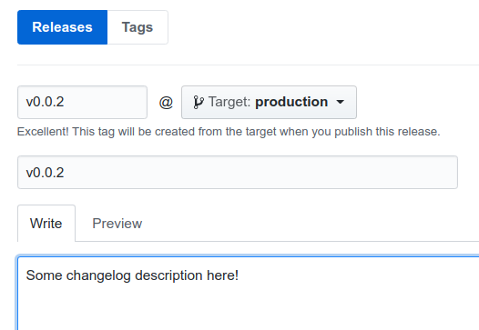

# Cooperative social balance app 

## Running Backend

1. Create virtualenv using python3 (follow https://virtualenvwrapper.readthedocs.io/en/latest/install.html)

        mkvirtualenv coobs

2. Activate the virtualenv

        workon coobs

3. Install python requirements

        make install-requirements

4. Copy the settings template

        cp coobs/settings/dev.template.py coobs/settings/dev.py

5. Generate new Django secret key and update `SECRET_KEY` value at `coobs/settings/dev.py`

        sed -i "s!SECRET_KEY = .*!SECRET_KEY = '$(openssl rand -base64 32)'!g" coobs/settings/dev.py

6. Setup postgres user for `coobs` database

        sudo -iu postgres bash -c "psql -c \"CREATE USER coobs WITH PASSWORD 'coobspass';\""
        sudo -iu postgres bash -c "psql -c \"ALTER ROLE coobs SET client_encoding TO 'utf8';\""
        sudo -iu postgres bash -c "psql -c \"ALTER ROLE coobs SET default_transaction_isolation TO 'read committed';\""
        sudo -iu postgres bash -c "psql -c \"ALTER ROLE coobs SET timezone TO 'UTC';\""

7. Configure database parameters at `coobs/settings/dev.py`

        DATABASES = {
                'default': {
                        'ENGINE': 'django.db.backends.sqlite3',
                        'NAME': 'coobs',
                        'USER': 'coobs',
                        'PASSWORD': 'coobspass',
                        'HOST': 'localhost',
                        'PORT': '5432'
                },
        }

8. Create the `coobs` database, run migrations and create Django superuser

        make reset-db

9. Run the server

        make server

10. API now should be accessible at:

        http://localhost:8000/api/

## Running Frontend

1. Install node dependencies:

        make install-frontend

2. Start the frontend app:
        
        make frontend

3. App core and landing page should be accesible on:

        http://localhost:8080/app
        http://localhost:8080/landing

## Frontend translations

### Adding new language

1. Go to `/coobs/frontend/locales` and add the new language in `langs.json` file

        key -> language short ISO code
        value -> language name

2. In the same folder add a new file with ISO code as name and `.json` extension

3. Add all existing translations for the new language.

### Adding new translation

1. Try to find if translation does not already exist.

2. Add new pair key/value in each translations file.

## Backend translations

### Adding new language

1. Add new locale file

        python manage.py makemessages -l <ISO_language_code>

        (i.e.) python manage.py makemessages -l es

### Adding new models

1. Define model name associated to translations

        class Meta:
          verbose_name = _('class_name')

### Adding new fields

1. Define field name associated to translations

        option -> verbose_name=_('field_name')

Common fields (Boolean, Char, Text, etc) can have this verbose name as the first parameter without include the verbose_name attribute name. 
The attribute name is a must for relations (ManyToMany, ForeignKeys, etc).

### Adding new model and field keys to .po files

1. Add keys to all .po files

        python manage.py makemessages

2. Translate each key for all existing languages

3. Compile new translations

        python manage.py compilemessages

## Generating new releases
To create a release just follow this steps:

1. Merge `master` into `production`

        git checkout master
        git pull
        git checkout production
        git pull
        git merge --no-ff master
        git push origin production
        git checkout master

2. Generate a new release [here](/fiqus/coobs/releases/new) and make sure to select the **production** branch!  
Write a brief release description and use a *senver* string for **tag** and **title** like: `vX.Y.Z`

3. Click the "Publish release" button and the [deploy action](.github/workflows/deploy.yml) will be triggered!
